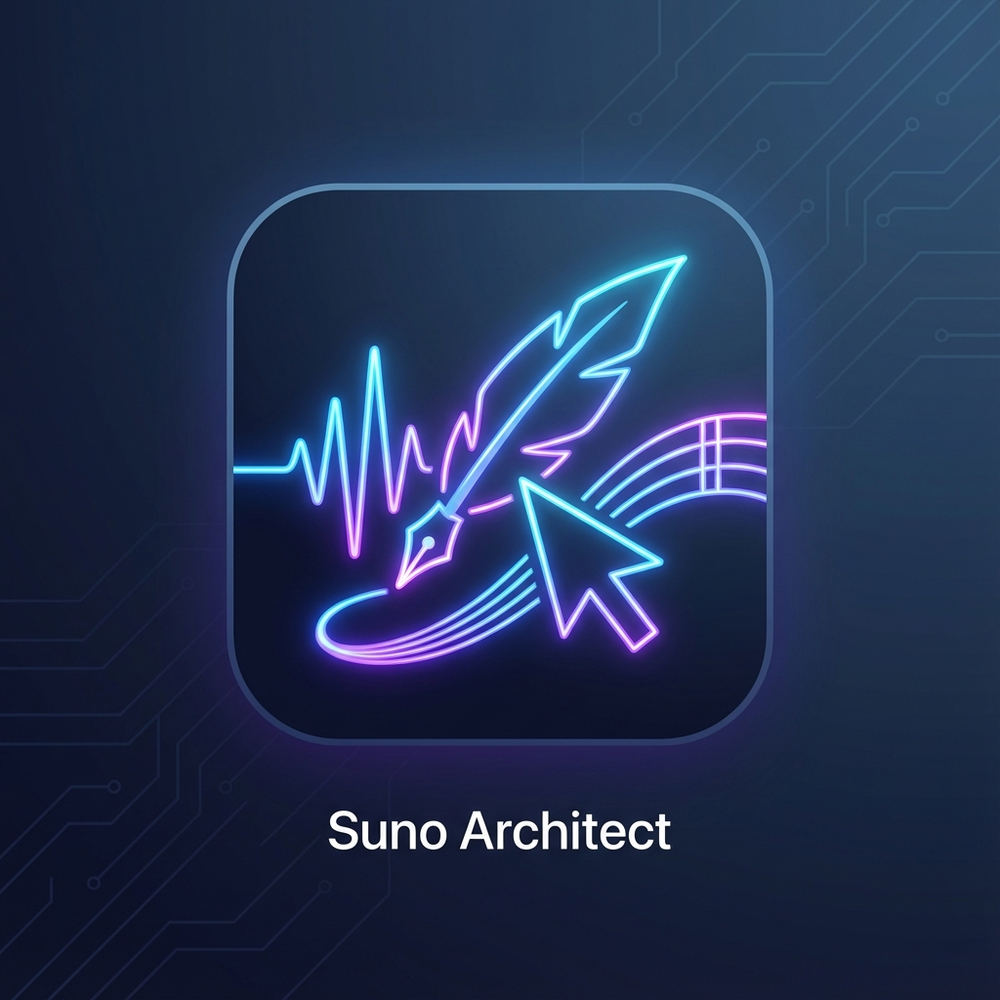
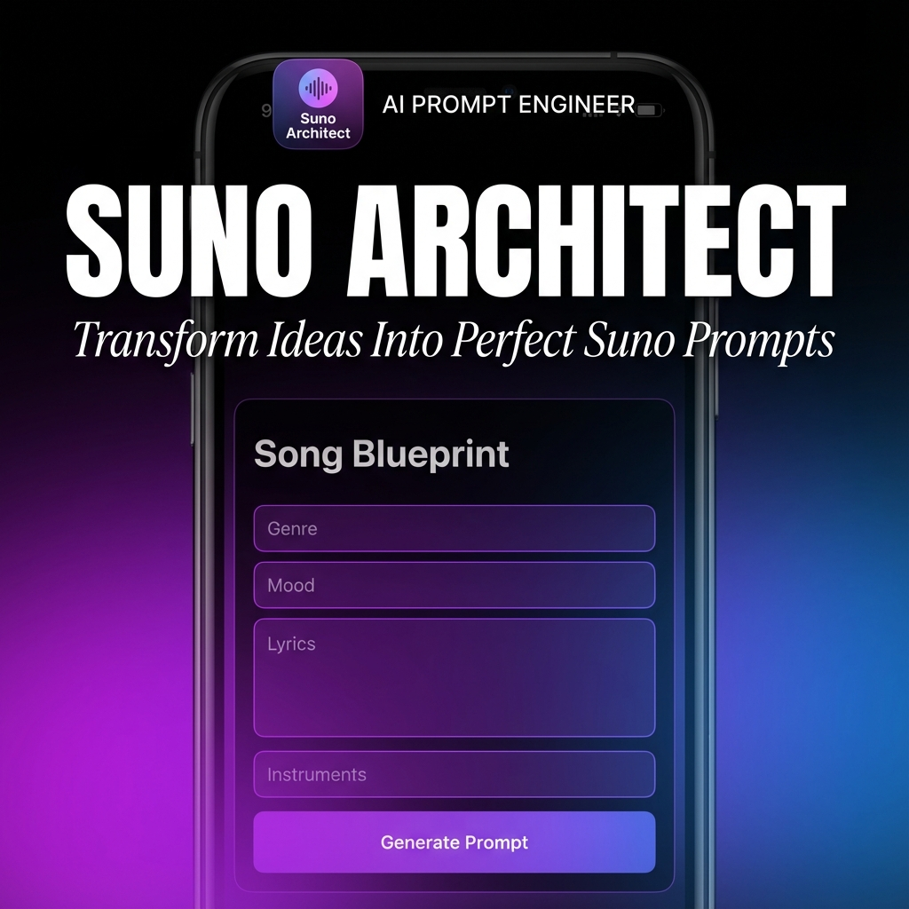
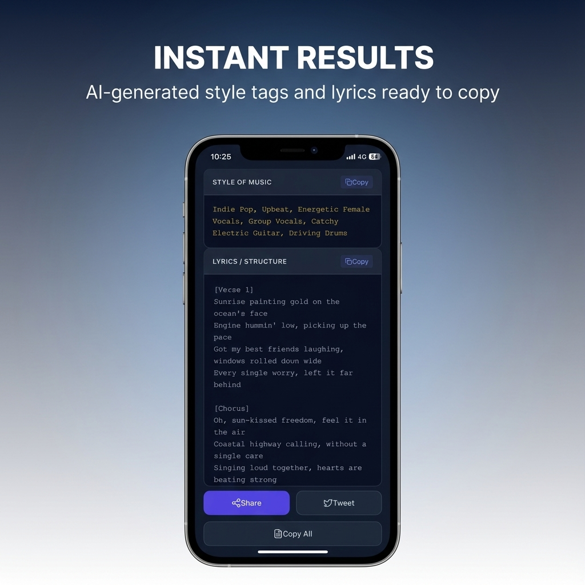
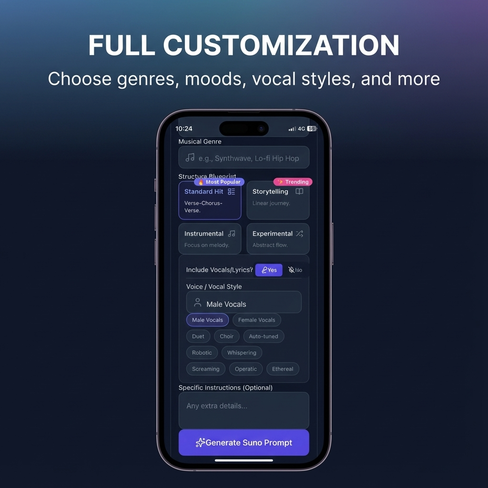

# Suno Architect

  

  <strong>🎵 AI Prompt Engineer for Suno Music Creation</strong>

  

---

## About

**Suno Architect** is the ultimate AI-powered prompt generator for Suno AI music creation. Transform your song ideas into professional, optimized prompts in seconds.

### ✨ Features

- **🎼 60+ Music Genres** — Pop, Hip Hop, Rock, EDM, Jazz, Metal, Lo-fi, Synthwave & more
- **📝 Smart Lyrics Generator** — AI-powered lyrics with proper [Verse], [Chorus], [Bridge] structure
- **🎭 Complete Creative Control** — Mood, vocal style, song structure customization
- **⚡ Instant Results** — Generate professional prompts in seconds
- **🌍 Multilingual** — Create songs in English, Vietnamese, and more
- **📤 Easy Export** — One-tap copy to clipboard or share to social media

---

## How It Works

1. **Choose Your Genre** — Select from 60+ music styles
2. **Set the Mood** — Pick the vibe for your song
3. **Add Details** — Describe your idea, customize vocals
4. **Generate** — AI creates your Suno-optimized prompt
5. **Copy to Suno** — Use in Custom Mode and create!

---

## Screenshots

  
  
  

---

## Support

Having issues or questions? We're here to help!

### 📧 Contact Us

**Email:** [exsoftcom@gmail.com](mailto:exsoftcom@gmail.com)

### 🐛 Report a Bug

Please include:
- Device model (e.g., iPhone 15 Pro)
- iOS version
- Steps to reproduce the issue
- Screenshots if applicable

### 💡 Feature Requests

We love hearing your ideas! Send us an email with your suggestions.

---

## FAQ

### Is Suno Architect free?
